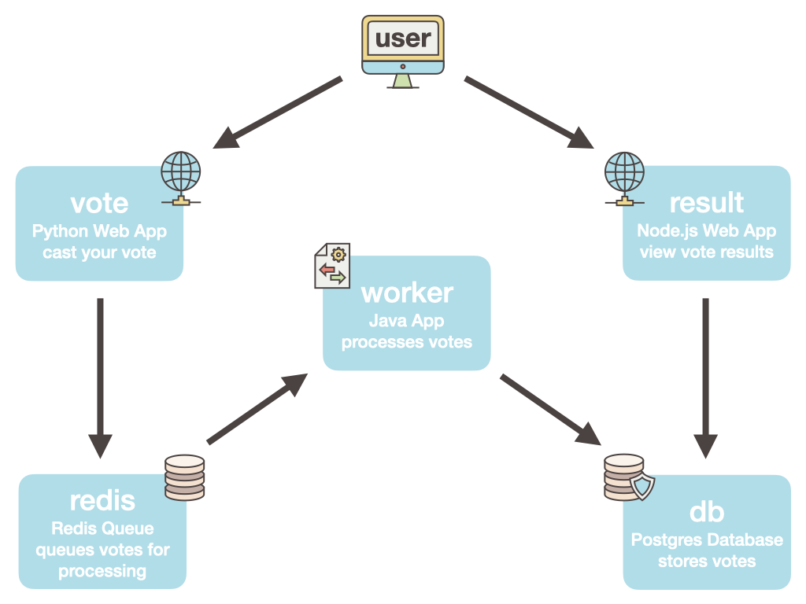

# Voting App Example


Example distributed solution for learning and testing twelve factor, distributed, and cloud native concepts. This is an extended version of the [Docker example voting app repo](https://github.com/dockersamples/example-voting-app).

This is the main repo for this solution. Each service in this solution has its own repo:

- Main README and example files: https://github.com/Verodin/example-voting
- Worker Service: https://github.com/Verodin/example-voting-worker
- Result Service: https://github.com/Verodin/example-voting-result
- Vote Service: https://github.com/Verodin/example-voting-vote
- Supporting files: https://github.com/Verodin/example-voting-misc
- DB migrations: https://github.com/Verodin/example-voting-db 


## Steps to get started

1. Clone this solution
    - Create a directory and clone the repos inside it
    - an `ls` should look like this

      ```shell
      .
      ..
      example-voting
      example-voting-db
      example-voting-misc
      example-voting-result
      example-voting-vote
      example-voting-worker
      ```

2. Install Docker
    - macOS: [Docker Desktop for macOS](https://hub.docker.com/editions/community/docker-ce-desktop-mac)
    - Windows: [Docker Desktop for Windows](https://hub.docker.com/editions/community/docker-ce-desktop-windows/) (supports WSL2 or Hyper-V mode, WSL2 preferred)
    - Linux: [Docker Engine](https://docs.docker.com/engine/install/) and [Docker Compose](https://docs.docker.com/compose/install/#install-compose-on-linux-systems)

## Run it in Docker Compose (runs on dockerd)
3. Run it in Docker Compose (`cd` to this repo root)
    - Bring up whole solution by building images from local source code
      ```shell
      docker-compose up
      ```
    - Bring up whole solution using Harbor images (without needing source code cloned)
      ```shell
      docker-compose -f docker-compose.images.yml up
      ```

4. Try the app UI
    - Vote for your favorite at http://localhost:5000
    - View the results (uses websockets) http://localhost:5001
    - Note: only one vote per browser, so use multiple browsers or incognito to vote more then once.

5. Clean up
    - Stop and remove most resources created by this compose file
      ```shell
      docker-compose down
      ```
    - Stop and remove all resources (including volumes and images) created by this compose file
      ```shell
      docker-compose down -v --rmi local
      ```
    - If you used the custom named compose file, use it in the command
      ```shell
      docker-compose -f docker-compose-images.yml down -v --rmi local
## Run it in Kubernetes

NOTE: don't run in Compose and Kubernetes at the same time, as we're using fixed published ports for this example and they will conflict on the host IP. Be sure to `docker-compose down` first.

1. Install Kubernetes
    - macOS: Enable it in Docker Desktop preferences
        - Disable it in preferences when not in use, to preserve resources
    - Windows: Enable it in Docker Desktop settings
        - Disable it in settings when not in use, to preserve resources
    - Linux: Install MicroK8s
        - If not on Ubuntu or downstream distro of Ubuntu, [install snap](https://snapcraft.io/docs/installing-snapd)
        - Install MicroK8s snap
          ```shell
          sudo snap install microk8s --classic
          ```
        - Check if it's ready
          ```shell
          microk8s status --wait-ready
          ```
        - Enable K8s DNS (required for services to work)
          ```shell
          microk8s enable dns
          ```
        - NOTE: for all `kubectl` commands, prepend with `microk8s`
          ```shell
          microk8s kubectl get all --all-namespaces
          ```

2. Deploy to Kubernetes
    - Apply the solution manifests (which use Harbor images) to the K8s cluster
      ```shell
      kubectl apply -R -f k8s-manifest/
      ```
    - List all resources created in the new `vote` namespace
      ```shell
      kubectl get all --namespace vote
      ```

3. Try the app UI
    - Vote for your favorite at http://localhost:5000
    - View the results (uses websockets) http://localhost:5001
    - Note: only one vote per browser, so use multiple browsers or incognito to vote more then once.

4. Clean up
    - When finished, delete all resources this solution created
      ```shell
      kubectl delete -R -f k8s-manifest/
      ```

